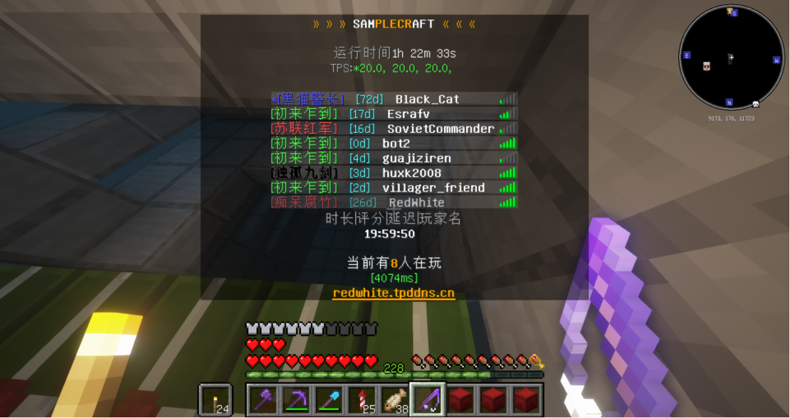

# 跃进

## 微茫的记忆

一周目跃进时期差不多是从笔者开始进入服务器，也即 2021 年 8 月开始的。跃进，即玩家数量开始大幅增长。

当时笔者的用名是四个字母加四个数字。

这里应该有一些截图的，可惜笔者更换了电脑，于是这些曾经被认为是垃圾的数据就再也找不回来了。

***

这是笔者当时的家的**复制件**，原存档的截图已经和原存档一同不幸丢失，不过好在投影文件成功保存了下来。

***

对于玩家，人多是件好事，因为这样的小地方人越多越热闹，也便有越多的乐趣。一周目，前面已经提到，和零周目是同样采用了“傻乐”的半纯生存玩法，因此对于一周目而言，人越多，服务器越好玩。

## 膨胀

从那时候开始便不断的有新的玩家开始进入服务器。这些新的玩家就如同着地的风滚草一般快速生根发芽，各地开花。

一时间服务器里喧嚣扰攘，群英荟萃，豪杰并起，建立了大量的基地，其中最大的有：

- 人数最多的[黑山基地](/docs/organizations.md#黑山基地)

- 发展速度最快的[蒟蒻基地](/docs/organizations.md#蒟蒻基地)和[光辉轨迹](/docs/organizations.md#光辉轨迹)

一时间随着基地的大量建立，服务器开始有了些许微妙的紧张，在此时它尚是良性的，至少其推动了服务器的进一步发展。

## 小小的转折

2022 年 3 月 19 日的 4 点左右，也即是大约半年之后，代理腐竹 Werewolfwolfy 出现了崩溃症状，主动选择了辞去代理腐竹的职务。

在这之后笔者几乎是钻着空子地成为了新一任管理员。

心智尚不成熟的笔者当即开始了自己的“宏图伟业”。之后，笔者以相当稚嫩的笔调写下了这篇曾经不被重视现在弥足珍贵的短篇小说。

可惜的是，这篇文章已经湮没于互联网的浪潮之中，只剩下一些微渺的痕迹。

而且非常显而易见的，根本没人看。（笑

在这之后，黑山基地开始慢慢的疏于管理了。